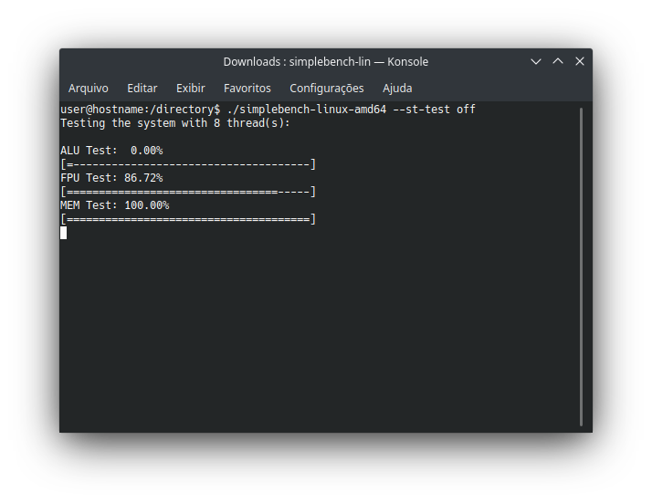

# SimpleBench

SimpleBench is a quick benchmarking tool I wrote to evaluate the performance of the systems I came across. It tests only the most basic arithmetic operations for integers and floating points besides memory bandwitdth.



It supports the following options:
```
SimpleBench - a quick benchmark to evaluate the core system performance
--show-gui [on/off]: enable/disable the text feedback during the tests
--st-test [on/off]: enable/disable the singlethread test
--mt-test [on/off]: enable/disable the multithread test
--threads [integer greater than zero]: sets the number of threads to run with
--hardware-level [integer greater than zero]: chooses how taxing the benchmark will be
      1: 32MB of RAM, 64KB of cache, lenght 1
      2: 64MB of RAM, 128KB of cache, lenght 4
      3: 128MB of RAM, 256KB of cache, lenght 16
      4: 512MB of RAM, 1MB of cache, lenght 64
      5: 2GB of RAM, 4MB of cache, lenght 256 (this is the current default)
      6: 8GB of RAM, 16MB of cache, lenght 1024 (HEDT users may want to use this one)
       :
      * every increase of 1 in the hardware level quadruples the requirements
      * there is some overhead in RAM requirement, you should have at least the amount required plus 5% FREE
--version: shows the benchmark version (not the program version)
--build: shows the program version, changes here have no effect on the score system
--help: shows this screen
```

SimpleBench is not a stress test and not is not a reliable benchmarking tool for any kind of advanced features the processor may have. 

Also, the algorithm is not complex so the compiler optimizations will basically skip all work it should have done. If you want to build from the sources, disable any optimizations to have a meaningful score. There are scripts to build with the correct compiler flags included in the source folder too.

These are the systems I benchmarked so far (I plan to include more systems in the future).

<table id="Scores">
    <tr> <!--Table header-->
        <th>ST Score</th>
        <th>MT Score</th>
        <th>Multiplier</th>
        <th>CPU Vendor</th>
        <th>CPU Model</th>
        <th>CPU Cores</th>
        <th>CPU Threads</th>
        <th>CPU All Core Turbo</th>
        <th>CPU Single Core Turbo</th>
        <th>CPU Cache</th>
        <th>RAM Vendor</th>
        <th>RAM Model</th>
        <th>RAM Amount</th>
        <th>RAM Channels</th>
        <th>RAM Frequency</th>
        <th>RAM Timings</th>
        <th>Operating System</th>
        <th>OS Update</th>
        <th>OS Kernel</th>
        <th>Hardware Level</th>
        <th>Version</th>
        <th>Build</th>
        <th>CLI Options</th>
    </tr>
    <tr> <!--Intel Xeon E3 1280-->
        <td>100.14</td><!--ST Score-->
        <td>426.92</td><!--MT Score-->
        <td>4.26</td><!--Multiplier-->
        <td>Intel</td><!--CPU Vendor-->
        <td>Xeon E3 1280</td><!--CPU Model-->
        <td>4</td><!--CPU Cores-->
        <td>8</td><!--CPU Threads-->
        <td>3600MHz</td><!--CPU All Core Turbo-->
        <td>3900MHz</td><!--CPU Single Core Turbo-->
        <td>8MB</td><!--CPU Cache-->
        <td>HyperX</td><!--RAM Vendor-->
        <td>Fury</td><!--RAM Model-->
        <td>8GB</td><!--RAM Amount-->
        <td>1</td><!--RAM Channels-->
        <td>1333MHz</td><!--RAM Frequency-->
        <td>8-8-8-18</td><!--RAM Timings-->
        <td>Arch Linux</td><!--Operating System-->
        <td>2019-03</td><!--OS Update-->
        <td>Linux 5.0</td><!--OS Kernel-->
        <td>5</td><!--Hardware Level-->
        <td>A0</td><!--Version-->
        <td>1-Linux-64</td><!--Build-->
        <td></td><!--CLI Options-->
    </tr>
    <tr> <!--Intel Celeron 430-->
        <td>30.73</td><!--ST Score-->
        <td>30.73</td><!--MT Score-->
        <td>1.00</td><!--Multiplier-->
        <td>Intel</td><!--CPU Vendor-->
        <td>Celeron 430</td><!--CPU Model-->
        <td>1</td><!--CPU Cores-->
        <td>1</td><!--CPU Threads-->
        <td>1800MHz</td><!--CPU All Core Turbo-->
        <td>1800MHz</td><!--CPU Single Core Turbo-->
        <td></td><!--CPU Cache-->
        <td>Markvision</td><!--RAM Vendor-->
        <td></td><!--RAM Model-->
        <td>2GB</td><!--RAM Amount-->
        <td>1</td><!--RAM Channels-->
        <td>667MHz</td><!--RAM Frequency-->
        <td></td><!--RAM Timings-->
        <td>Debian 9</td><!--Operating System-->
        <td>2019-03</td><!--OS Update-->
        <td>Linux 4.9</td><!--OS Kernel-->
        <td>4</td><!--Hardware Level-->
        <td>A0</td><!--Version-->
        <td>1-Linux-64</td><!--Build-->
        <td>--hardware-level 4</td><!--CLI Options-->
    </tr>
    <tr> <!--Template-->
        <td></td><!--ST Score-->
        <td></td><!--MT Score-->
        <td></td><!--Multiplier-->
        <td></td><!--CPU Vendor-->
        <td></td><!--CPU Model-->
        <td></td><!--CPU Cores-->
        <td></td><!--CPU Threads-->
        <td></td><!--CPU All Core Turbo-->
        <td></td><!--CPU Single Core Turbo-->
        <td></td><!--CPU Cache-->
        <td></td><!--RAM Vendor-->
        <td></td><!--RAM Model-->
        <td></td><!--RAM Amount-->
        <td></td><!--RAM Channels-->
        <td></td><!--RAM Frequency-->
        <td></td><!--RAM Timings-->
        <td></td><!--Operating System-->
        <td></td><!--OS Update-->
        <td></td><!--OS Kernel-->
        <td></td><!--Hardware Level-->
        <td></td><!--Version-->
        <td></td><!--Build-->
        <td></td><!--CLI Options-->
    </tr>
</table>

## [1deterministic](https://github.com/1deterministic), 2019
