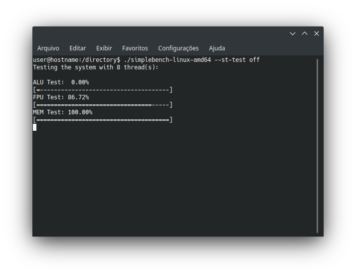

# SimpleBench

SimpleBench is a quick benchmarking tool I wrote to evaluate the performance of the systems I came across. It tests only the most basic arithmetic operations for integers and floating points besides memory bandwitdth.



It supports the following options:
```
SimpleBench - a quick benchmark to evaluate the core system performance
--show-gui [on/off]: enable/disable the text feedback during the tests
--st-test [on/off]: enable/disable the singlethread test
--mt-test [on/off]: enable/disable the multithread test
--threads [integer greater than zero]: sets the number of threads to run with
--hardware-level [integer greater than zero]: chooses how taxing the benchmark will be
      1: 128MB of RAM, 256KB of cache, standard duration
      2: 512MB of RAM, 1MB of cache, 4 times longer
      3: 2GB of RAM, 4MB of cache, 16 times longer
       :
      * every increase of 1 in the hardware level quadruples the requirements
      * there is some overhead in RAM requirement, you should have at least the amount required plus 5% FREE
--version: shows the benchmark version (not the program version)
--build: shows the program version, changes here have no effect on the score system
--help: shows this screen
```

SimpleBench is not a stress test and not is not a reliable benchmarking tool for any kind of advanced features the processor may have. 

Also, the algorithm is not complex so the compiler optimizations will basically skip all work it should have done. If you want to build from the sources, disable any optimizations to have a meaningful score. There are scripts to build with the correct compiler flags included in the source folder too.

These are the systems I benchmarked so far (I plan to include more systems in the future).

<table id="Scores 1.1">
    <tr> <!--Table header-->
        <th>Version</th>
        <th>Build</th>
        <th>ST Score</th>
        <th>MT Score</th>
        <th>Multiplier</th>
        <th>Architecture</th>
        <th>CPU Vendor</th>
        <th>CPU Model</th>
        <th>CPU Base Clock</th>
        <th>CPU Boost Clock</th>
        <th>CPU Cores</th>
        <th>CPU Threads</th>
        <th>CPU TDP</th>
        <th>CPU LLC</th>
        <th>RAM Vendor</th>
        <th>RAM Model</th>
        <th>RAM Clock</th>
        <th>RAM Channels</th>
        <th>RAM Capacity</th>
        <th>RAM Latency</th>
        <th>Operating System</th>
        <th>OS Update</th>
        <th>Kernel</th>
        <th>CLI Options</th>
        <th>Build</th>
    </tr>
    <tr> <!--Template-->
        <td></td><!--Version-->
        <td></td><!--Build-->
        <td></td><!--ST Score-->
        <td></td><!--MT Score-->
        <td></td><!--Multiplier-->
        <td></td><!--Architecture-->
        <td></td><!--CPU Vendor-->
        <td></td><!--CPU Model-->
        <td></td><!--CPU Base Clock-->
        <td></td><!--CPU Boost Clock-->
        <td></td><!--CPU Cores-->
        <td></td><!--CPU Threads-->
        <td></td><!--CPU TDP-->
        <td></td><!--CPU LLC-->
        <td></td><!--RAM Vendor-->
        <td></td><!--RAM Model-->
        <td></td><!--RAM Clock-->
        <td></td><!--RAM Channels-->
        <td></td><!--RAM Capacity-->
        <td></td><!--RAM Latency-->
        <td></td><!--Operating System-->
        <td></td><!--OS Update-->
        <td></td><!--Kernel-->
        <td></td><!--CLI Options-->
        <td></td><!--Build-->
    </tr>
</table>

## [1deterministic](https://github.com/1deterministic), 2019
